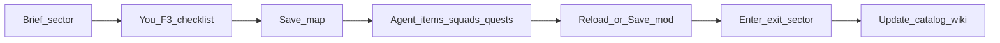

# Конвейер локаций Эрни

Ускорение достройки тактических локаций острова Эрни без массовой правки `objects.lua`.

## Роли

| Кто | Делает | Не делает |
|-----|--------|-----------|
| Владелец | F3: террейн, Rooms/slabs, пропы, Pos/Deployment markers, Save map | Не ждёт кликов агента в редакторе |
| Агент | Бриф, чеклист F3, `ModItemSector` / campaign / squads / quests / images / setpiece companions, аудит, docs | Не массово переписывает `Maps/*/objects.lua` и grids |

См. также [`AGENT_BRIEFING.md`](AGENT_BRIEFING.md) и suite playbook `../../jazz/.agents/docs/playbooks/maps-content.md`.

## Шаблон брифа

Перед F3 зафиксировать:

- `sectorId`, display name, роль (бой / хаб / переход / квест)
- `mapName` или донор для клона в редакторе
- Соседи и дороги (N/E/S/W), POI-флаги
- Враги: `InitialSquads` / patrol / strong / extra
- Маркеры: Entrance/Deployment, civilian, quest Pos, setpiece Pos
- Квесты / conversations на секторе
- Картинки: `image`, `override_loading_screen` (`Mod/FhNNYd/Images/...`)
- Критерий «готово»: вход с 2 направлений, конфликт/без, квестовый триггер

Доноры по умолчанию: берег ← M2; деревня ← I5; outpost ← I7; underground ← I6_Underground. Клон карты — только в F5/Map Editor; агент после Save map подключает `mapName`.

Брифы сессий: [`briefs/`](briefs/).

## Фазы одной локации

1. **Бриф** — снимок из `items.lua` + [`content/quests-locations-enemies.md`](content/quests-locations-enemies.md).
2. **Чеклист F3** — короткий список только для этой карты; геометрию правит владелец.
3. **Save map** — владелец. Если редактор мода был открыт до правок агента на диске — Reload/переоткрыть.
4. **Обвязка** — агент: `ModItemSector` + дубль в `CampaignPreset.Sectors`, squads/Events, quest refs, images, setpiece companion при необходимости; новые UnitData/squad → `JAZZ Units` + sync skill.
5. **Проверка** — `check-generated-sync` для maps; `-IncludeMapsContent` только на названный `mapName`/сектор; smoke вход/выход/квест.
6. **Docs** — строка в catalog + [`content/ernie-island-guide.md`](content/ernie-island-guide.md) / suite `jazz/docs/technical/systems/maps-quests-content-catalog.md` при пользовательском эффекте.

## Очередь Эрни

1. Квестово-критичные: **J7**, **M2/M3**, **I6** + underground, **K4**
2. Хабы: **I5**, **I7**, **L1**, **M4**
3. Периметр виллы: **K3–K5, L3–L5**
4. Берег и переходы: **M5, M6, J4, J5, I2, I3, L6/L7, K6**

На сессию — одна локация (или surface + underground).

## Безопасность

- Не править геометрию массово в `objects.lua` с диска.
- Не делать recursive scan всего `Maps/`.
- После правки `items.lua` агентом — Reload перед Save в редакторе.
- `goEntityPersist.cpp: cmp` на старте — Ignore; Lua/runtime ошибки — нет.
- Коммиты только по просьбе владельца; сообщения на русском.

## Старт сессии

Сообщение владельца: `локация <sectorId>` (или молчание → первая из очереди). Агент выдаёт бриф + чеклист F3; после Save map — обвязка и smoke.
